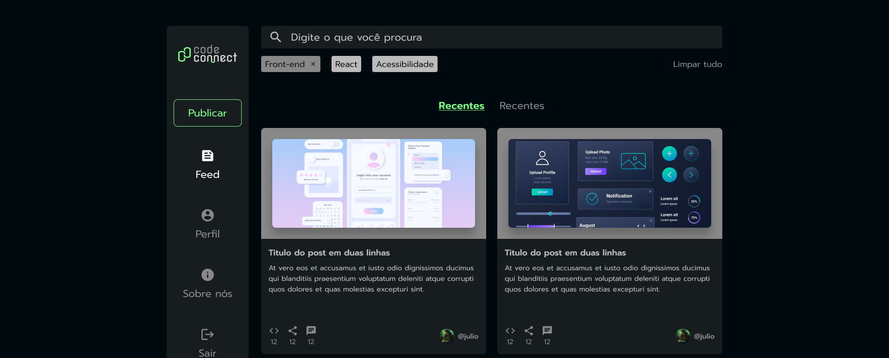

# 🧠 Iniciando um Projeto React com Vite

## 👨‍🏫 Professor

**Nome:** Claudeny Avelino  
**E-mail:** claudeny.avelino@gmail.com  
**Turma:** JOVEM-TECH-TC-REACT-JS

---

## 🖥️ Introdução

Criar um projeto React do zero pode parecer complicado, pois estamos acostumados a trabalhar com HTML, CSS e JavaScript.  
O **Vite** facilita muito essa tarefa, criando automaticamente a estrutura base de um projeto moderno.

> 🧩 O Vite é uma ferramenta de build de front-end de próxima geração, rápida e otimizada.

---

## ⚙️ Acessando o site do Vite

1. Acesse o site [vitejs.dev](https://vitejs.dev).
2. Clique no botão **“Get Started”**.
3. Na documentação, procure a seção **“Scaffolding Your First Vite Project”**.
4. Verifique se você possui o **Node.js** instalado (versão **18+** recomendada).

---

## 🧰 Pré-requisitos

Antes de começar, verifique se você possui instalado:

- **Node.js 18 ou superior**
- **npm (Node Package Manager)**
- Um editor de código (recomendado: **Visual Studio Code**)
***OBS:***

```
node -v

nmp -v
```
Para corrigir erro
```
npm install -g npm@8.15.0
```

---

## 💡 Criando o projeto

Na documentação, encontramos o comando base:

```
npm create vite@latest
```

🧩 **_Criando um projeto React_**

Para criar uma aplicação React com Vite, utilize o comando:

```
npm create vite@latest codeconnect -- --template react

```

```
Em seguida.
> npx
> create-vite codeconnect react

│
◆  Select a framework:
│  ○ Vanilla
│  ○ Vue
│  ● React
│  ○ Preact
│  ○ Lit
│  ○ Svelte
│  ○ Solid
│  ○ Qwik
│  ○ Angular
│  ○ Marko
│  ○ Others

```

Em seguida.

```
> npx
> create-vite codeconnect react

│
◇  Select a framework:
│  React
│
◆  Select a variant:
│  ○ TypeScript
│  ○ TypeScript + React Compiler
│  ○ TypeScript + SWC
│  ● JavaScript
│  ○ JavaScript + React Compiler
│  ○ JavaScript + SWC
│  ○ React Router v7 ↗
│  ○ TanStack Router ↗
│  ○ RedwoodSDK ↗
│  ○ RSC ↗

```

```
> npx
> create-vite codeconnect react

│
◇  Select a framework:
│  React
│
◇  Select a variant:
│  JavaScript
│
◆  Use rolldown-vite (Experimental)?:
│  ○ Yes
│  ● No
```

```
> npx
> create-vite codeconnect react

│
◇  Select a framework:
│  React
│
◇  Select a variant:
│  JavaScript
│
◇  Use rolldown-vite (Experimental)?:
│  No
│
◆  Install with npm and start now?
│  ● Yes / ○ No

```

```
  VITE v7.1.12  ready in 456 ms

  ➜  Local:   http://localhost:5173/
  ➜  Network: use --host to expose
  ➜  press h + enter to show help
```

**Explicação:**

npm create vite@latest → cria o projeto usando a versão mais recente do Vite

codeconnect → nome do projeto

-- --template react → define o template (React)

-- → necessário em versões do npm 7+

📁 **_Escolhendo o local do projeto_**

Crie uma pasta (ex: ?/dev)

Clique com o botão direito → Abrir no terminal

Execute o comando de criação dentro dessa pasta

⚡ **_Após criar o projeto_**

No terminal, será exibida uma série de mensagens — são os arquivos sendo gerados.
Depois, execute os comandos:

```
cd codeconnect
npm install
```

> Esses comandos acessam a pasta do projeto e instalam todas as dependências necessárias.

🚀 **_Executando o projeto_**

Para iniciar o servidor de desenvolvimento, use:

```
npm run dev
```

Você verá algo como:

```
Local: http://127.0.0.1:5173/
Network: use --host to expose
press h + enter to show help
```

🌐 **_Visualizando o projeto_**

Copie o link exibido no terminal:
http://000.0.0.0:5173/

Cole no seu navegador.

Você verá:

Logotipos do Vite e React

Texto “Vite + React”

Um contador interativo

🧭 **_Explorando no VS Code_**

Abra a pasta do projeto no Visual Studio Code:

A estrutura criada pelo Vite inclui:

Arquivos de configuração

Componentes React iniciais

Setup básico de build e execução

🏁 **_Conclusão_**

O Vite torna a criação de projetos React mais simples e rápida.
Com poucos comandos, você já tem um ambiente de desenvolvimento pronto, moderno e otimizado.

> 💬 Próximo passo: explorar a estrutura de pastas e entender o que o Vite cria automaticamente.

# Estrutura de Pastas no Projeto React com Vite

## Sumário
1. [Introdução](#introdução)
2. [Acessando o Projeto](#acessando-o-projeto)
3. [Explorando o Projeto no VS Code](#explorando-o-projeto-no-vs-code)
4. [Pasta node_modules](#pasta-nodemodules)
5. [Pasta public](#pasta-public)
6. [Pasta src](#pasta-src)
7. [Comandos Úteis](#comandos-úteis)
8. [Conclusão](#conclusão)
9. [Créditos do Projeto](#créditos-do-projeto)

---

## Introdução

Vamos entender o que o **Vite** fez para facilitar a criação de um projeto em **React** e como está organizada sua **estrutura de pastas**.

O Vite é uma ferramenta de build moderna que torna o processo de desenvolvimento mais rápido, leve e eficiente.

---

## Acessando o Projeto

Primeiro, abra o **explorador de arquivos** do seu computador e navegue até a pasta `dev`.  
Dentro dela, deve existir a pasta **codeconnect**, criada anteriormente via terminal.

Siga os passos:

1. Abra a pasta `codeconnect`.  
2. Clique com o **botão direito do mouse** → **"Abrir no Terminal"**.  
3. No terminal, execute o comando abaixo para abrir o projeto no **VS Code**:

   ```
   bash
   code .
```

>Dica: Existem várias maneiras de abrir o VS Code. Essa é apenas uma das mais práticas.
```
---

## Explorando o Projeto no VS Code

Com o projeto aberto, olhe para o Explorador de Arquivos (painel esquerdo do VS Code).
Você verá diversas pastas e arquivos — vamos entender o papel de cada um deles.

## Pasta node_modules

Essa pasta contém todas as dependências externas utilizadas no projeto.

Exemplos de dependências:

React → biblioteca principal para criar interfaces.

Babel → traduz o código JSX para o navegador entender.

Vite → servidor e empacotador rápido para desenvolvimento.

Importante:

A pasta node_modules é muito grande e pesada.

Nunca envie essa pasta para o repositório GitHub.

>Atenção:
Sempre que alguém clonar o projeto, basta rodar o comando: **npm** install


npm install

Atenção:
Sempre que alguém clonar o projeto, basta rodar o comando:

npm install


Esse comando recriará automaticamente a pasta node_modules com todas as dependências do projeto.

## Pasta public

A pasta public é usada para armazenar arquivos estáticos — imagens, ícones ou qualquer arquivo que possa ser acessado globalmente no projeto.

Exemplo de conteúdo:
```
public/
 ├── vite.svg       # Logo padrão do Vite
 ├── logo.png       # Imagem personalizada do projeto
 └── favicon.ico    # Ícone do site
```

Dica:
Tudo dentro de public/ é servido diretamente pelo servidor, então evite colocar arquivos sensíveis nessa pasta.

## Pasta src

A pasta src é o coração do projeto.
Aqui ficam todos os arquivos do código-fonte: componentes React, estilos, imagens e lógica da aplicação.

Exemplo de estrutura:
```
src/
 ├── assets/          # Imagens e arquivos de estilo (CSS, SVG)
 ├── components/      # Componentes reutilizáveis
 ├── App.jsx          # Componente principal da aplicação
 ├── main.jsx         # Ponto de entrada do React
 └── index.css        # Estilos globais
```

Explicando:

>App.jsx → arquivo principal que renderiza a interface.

>main.jsx → inicializa o React e renderiza o App.

>assets/ → guarda imagens e estilos importados pelos componentes.

## Comandos Úteis

| Comando                       | Descrição                                                   |
| ----------------------------- | ----------------------------------------------------------- |
| `npm install`                 | Instala todas as dependências listadas no `package.json`    |
| `npm run dev`                 | Inicia o servidor de desenvolvimento                        |
| `npm run build`               | Gera uma versão otimizada para produção                     |
| `npm run preview`             | Executa o build localmente para testes                      |
| `npm create vite@latest`      | Cria um novo projeto Vite                                   |
| `npm install react react-dom` | Instala o React e o React DOM manualmente (caso necessário) |


Aqui estão os comandos mais comuns para trabalhar com o projeto React criado com Vite:

Comando	Descrição

| Comando                       | Descrição                                                   |
| ----------------------------- | ----------------------------------------------------------- |
| `npm install`                 | Instala todas as dependências listadas no `package.json`    |
| `npm run dev`                 | Inicia o servidor de desenvolvimento                        |
| `npm run build`               | Gera uma versão otimizada para produção                     |
| `npm run preview`             | Executa o build localmente para testes                      |
| `npm create vite@latest`      | Cria um novo projeto Vite                                   |
| `npm install react react-dom` | Instala o React e o React DOM manualmente (caso necessário) |


## Conclusão

Agora que você conhece as três pastas principais do projeto React criado com o Vite:

Pasta	Função
node_modules	Contém as dependências e bibliotecas externas
public	Armazena arquivos estáticos reutilizáveis
src	Contém todo o código-fonte e a lógica do projeto

Nos próximos passos, você explorará os arquivos dentro da pasta src e entenderá como o React estrutura os componentes e renderiza as interfaces.


# Entendendo os Arquivos do Projeto React com Vite

## Sumário
1. [Introdução](#introdução)
2. [Arquivos Dentro da Pasta src](#arquivos-dentro-da-pasta-src)
3. [O Componente Principal App.jsx](#o-componente-principal-appjsx)
4. [Arquivo de Estilo App.css](#arquivo-de-estilo-appcss)
5. [Arquivo main.jsx](#arquivo-mainjsx)
6. [Arquivo index.css](#arquivo-indexcss)
7. [Criando um Novo Componente](#criando-um-novo-componente)
8. [Conclusão](#conclusão)
9. [Créditos do Projeto](#créditos-do-projeto)

---

## Introdução

Agora que já nos familiarizamos com as pastas do projeto, vamos entender **o que é cada arquivo dentro** delas.

O foco desta aula é explorar os principais arquivos dentro da pasta `src`, que é onde colocamos todo o código que compõe o nosso projeto — seja lógica ou conteúdo visual.

---

## Arquivos Dentro da Pasta src

Dentro da pasta `src`, encontramos inicialmente uma subpasta chamada **assets**.  
Nela, há uma imagem chamada `react.svg`.

A lógica da pasta `assets` é semelhante à da pasta `public`: podemos colocar **imagens, códigos e outros recursos**.  
A principal diferença entre as duas pastas depende do **contexto da aplicação** — e essa diferença será explicada na seção “Para saber mais”.

---

## O Componente Principal App.jsx

Após a pasta `assets`, encontramos os arquivos `App.jsx` e `App.css`.

O arquivo **`App.jsx`** é uma **função que retorna elementos HTML** — isso significa que ele é um **componente React**.

Quando uma função retorna elementos HTML, dizemos que ela é um **componente JSX** (`.jsx` = JavaScript XML).  
Ele é o **componente principal** da aplicação, ou seja, tudo que queremos imprimir na primeira renderização do site estará dentro dele.

No código, podemos observar que:

- A partir da **linha 9**, temos o `return`, que contém o conteúdo exibido na tela (links, imagens, etc.).
- Dentro do `return`, há dois logos (do **Vite** e do **React**).
- Por volta da **linha 21**, há um contador interativo, visível ao abrir o servidor local.

Esses elementos são justamente o que vimos quando executamos o projeto no navegador.

---

## Arquivo de Estilo App.css

O arquivo **`App.css`** contém os **estilos aplicados ao componente `App.jsx`**.

Nele, encontramos:
- Tamanhos predefinidos para imagens;
- Sombras nos elementos;
- Cores e espaçamentos.

Tudo o que estiliza o que é retornado dentro do `App.jsx` está definido no `App.css`.

---

## Arquivo main.jsx

O arquivo **`main.jsx`** é o **ponto de entrada da aplicação React**.  
Sua função é **definir a renderização** dos componentes dentro da estrutura HTML do projeto.

O `main.jsx` cria uma **raiz** em um elemento com o `id="root"` no arquivo HTML principal.  
Dentro dessa raiz, ele **renderiza o componente principal (`App`)**.

Por exemplo, no código:

```
jsx
ReactDOM.createRoot(document.getElementById('root')).render(
  <React.StrictMode>
    <App />
  </React.StrictMode>,
)
```

# Criando o Componente Sidebar no Projeto React

## Sumário
1. [Introdução](#introdução)
2. [Estrutura Inicial do Componente](#estrutura-inicial-do-componente)
3. [Importando e Utilizando Imagens](#importando-e-utilizando-imagens)
4. [Adicionando o Botão Publicar](#adicionando-o-botão-publicar)
5. [Adicionando os Itens do Menu](#adicionando-os-itens-do-menu)
6. [Boas Práticas com Imagens SVG](#boas-práticas-com-imagens-svg)
7. [Desafio Final](#desafio-final)
8. [Créditos do Projeto](#créditos-do-projeto)

---

## Introdução

Agora que sabemos onde os componentes serão construídos, é hora de entender **como criar um componente em React**.

Nesta aula, vamos criar o componente **Sidebar**, responsável pelo **menu lateral** da nossa aplicação.

---

## Estrutura Inicial do Componente

Dentro da pasta do projeto, siga o caminho:

>src > components > Sidebar > index.jsx


No arquivo `index.jsx`, começamos com a definição da função do componente:

```
jsx
export default function Sidebar() {
    return();
}
```
Esse trecho define um Function Component — ou Componente de Função.
Nele:

* Utilizamos a palavra reservada function para declarar a função.

* Damos o nome ao componente (Sidebar).

* Usamos export default para exportar o componente por padrão.

* Dentro da função, temos um return(), que indica o conteúdo a ser exibido na tela.

Todos os componentes que criarmos seguirão essa mesma estrutura.

**Importando e Utilizando Imagens**

No Modelo, podemos visualizar o design do nosso projeto.
O Sidebar é uma barra de menu lateral que contém:

O logo do CodeConnect

Um botão de publicar

E uma lista de links, cada um com um ícone e um nome.

## 🔽 Baixando as imagens do Modelo


---
**Prototipo**



---
---


[Baixe aqui: Imagens assets](https://1drv.ms/f/c/08a6d1d355a14254/EuTDnLjXCY5HqJv1raU0xvIByA8vu2mnlUn38OQNE_hntw?e=eQg9pH)

---

Clique sobre uma imagem (ex: Logo) até ela ficar isolada no menu à esquerda.

Vá até o menu à direita e clique na aba Export.

Clique no botão + e altere o formato para SVG.

Clique em Export para baixar.

Repita para as outras imagens.

>💡 Por que SVG?
Porque é o formato ideal para ícones e gráficos vetoriais — permite redimensionar sem perder qualidade.

**🗂️ Organizando as imagens**

Mova as imagens baixadas da pasta de downloads para dentro do seu projeto:
```
src > components > Sidebar > assets
```

Essa pasta assets conterá apenas as imagens usadas dentro da Sidebar.

Adicionando o Logo

No index.jsx, vamos importar o arquivo da logo e exibi-lo no HTML:
```
import Logo from './assets/Logo.svg';

export default function Sidebar() {
    return(
        <aside>
            
        </aside>
    );
}
```

**🧠 Explicando:**

* import Logo from './assets/Logo.svg' → Importa a imagem e atribui a ela o nome Logo.

*  → Exibe a imagem no componente.

* alt='Logo do CodeConnect' → Texto alternativo, usado para acessibilidade.
>Essa é a forma recomendada de importar imagens em React, permitindo o uso dinâmico de arquivos no JSX.


**Adicionando o Botão Publicar**

O próximo elemento no Modelo é o botão “Publicar”, que faz parte do menu lateral.
Vamos adicionar ele dentro de um <nav> (menu de navegação).

Atualize seu index.jsx:
```
import Logo from './assets/Logo.svg';

export default function Sidebar() {
    return(
        <aside>
            
            <nav>
                <ul>
                    <li>
                        <a href='#'>Publicar</a>
                    </li>
                </ul>
            </nav>
        </aside>
    );
}
```
>✅ Agora o Sidebar já contém o logo e o botão de publicação!

**Adicionando os Itens do Menu**

Em seguida, vamos adicionar os outros links de navegação, começando pelo Feed.

Primeiro, importe o ícone do feed logo abaixo da importação da logo:

```import Logo from './assets/Logo.svg';
import Feed from './assets/feed.svg';

export default function Sidebar() {
    return(
        <aside>
            
            <nav>
                <ul>
                    <li>
                        <a href='#'>Publicar</a>
                    </li>
                    <li>
                        <a href='#'>
                            
                            <span>Feed</span>
                        </a>
                    </li>
                </ul>
            </nav>
        </aside>
    );
}
```

**💬 Observações importantes:**

**Desafio Final**

Crie os outros itens da lista dentro da tag <ul> seguindo o mesmo padrão:
```
<li>
  <a href='#'>
    
    <span>Nome do Item</span>
  </a>
</li>
```
>✨ Dica:
Crie um arquivo Sidebar.css e estilize o componente — adicionando espaçamentos, cores, fontes e tamanhos dos ícones.


# Finalizando o Componente Sidebar

## Sumário
1. [Introdução](#introdução)
2. [Adicionando Novos Itens ao Menu](#adicionando-novos-itens-ao-menu)
3. [Código Completo do Sidebar](#código-completo-do-sidebar)
4. [Explicando o Código](#explicando-o-código)
5. [Organização dos Arquivos](#organização-dos-arquivos)
6. [Conclusão](#conclusão)
7. [Créditos do Projeto](#créditos-do-projeto)

---

## Introdução

Até agora, construímos o **componente Sidebar** com o logo do CodeConnect, o botão **Publicar** e o primeiro link do menu — o **Feed**.

Nesta parte da aula, vamos adicionar os **demais itens de navegação** conforme o layout do **Modelo**, finalizando a estrutura do componente.

---

## Adicionando Novos Itens ao Menu

Os novos itens que serão adicionados são:

- **Perfil** (`Account.svg`)  
- **Sobre nós** (`Info.svg`)  
- **Sair** (`Logout.svg`)

Esses ícones devem estar dentro da pasta:
```
import Feed from './assets/feed.svg';
import Account from './assets/account_circle.svg';
import Info from './assets/info.svg';
import Logout from './assets/logout.svg';
```

## Implementando os Links de Navegação

Chegou a hora de dar continuidade na criação do componente **Sidebar**. O foco desta etapa é implementar os **links de navegação** na barra lateral, cada um contendo um **ícone** e um **texto correspondente**.

### Opinião do Instrutor

Cada item do menu de links de navegação é composto por:

- Um link (`<a>`) com o atributo `href`
- Um ícone (``) importado e atribuído a um nome
- Um texto (`<span>`) indicando a função do link

Para importar os ícones, utilizamos a seguinte sintaxe:

```
javascript
import Feed from './assets/feed.svg';
import Account from './assets/account_circle.svg';
import Info from './assets/info.svg';
import Logout from './assets/logout.svg';
```

>💡 Dica: Certifique-se de que os nomes dos arquivos SVG estejam corretos e respeitem maiúsculas e minúsculas.

**Criando os Itens do Menu**

Cada item de navegação é representado por uma <li>, que contém:

Um ` <a href='#'> `

Uma `` apontando para o ícone

Um `<span>` com o texto do link

O resultado final dos itens adicionais é:
```
<li>
    <a href='#'>
        
        <span>Perfil</span>
    </a>
</li>
<li>
    <a href='#'>
        
        <span>Sobre nós</span>
    </a>
</li>
<li>
    <a href='#'>
        
        <span>Sair</span>
    </a>
</li>
```

## Observações Importantes

O `alt=''` é deixado vazio para evitar redundância na leitura por leitores de tela, já que o texto do `<span>` descreve o link.

A importação dos ícones deve ser feita antes do `export default function Sidebar().`

Os links adicionados (Perfil, Sobre nós, Sair) seguem o mesmo padrão do link Feed já implementado anteriormente.

Com isso, finalizamos a implementação de todos os links de navegação do Sidebar. O próximo passo será estilizar a barra lateral para que fique visualmente igual ao design no Modelo.

```
                    <li>
                        <a href='#'>
                            
                            <span>Perfil</span>
                        </a>
                    </li>
                    <li>
                        <a href='#'>
                            
                            <span>Sobre nós</span>
                        </a>
                    </li>
                    <li>
                        <a href='#'>
                            
                            <span>Sair</span>
                        </a>
                    </li>

```
# 🧩 Finalizando o Componente Sidebar

## 📚 Sumário
- [Introdução](#introdução)
- [Importação das Imagens](#importação-das-imagens)
- [Implementação do Sidebar](#implementação-do-sidebar)
- [Limpando-o-appjsx](#limpando-o-appjsx)
- [Renderizando-o-Componente-Sidebar](#renderizando-o-componente-sidebar)
- [Executando-o-Servidor-Local](#executando-o-servidor-local)
- [Removendo-Estilizações-Padrão](#removendo-estilizações-padrão)
- [Importando-a-Fonte-no-Projeto](#importando-a-fonte-no-projeto)
- [Criando-Variáveis-de-Cores-e-Fonte](#criando-variáveis-de-cores-e-fonte)
- [Conclusão](#conclusão)
- [Créditos](#créditos)

---

## 🧠 Introdução

Vamos comparar os resultados do desafio!  
Finalizamos a importação das imagens no nosso `index.jsx`.  

Eu nomeei como **Account**, **Info** e **Logout**, mas vocês não precisam usar exatamente os mesmos nomes — o importante é que o diretório e o caminho estejam corretos conforme o projeto.  

Depois, inserimos essas imagens em itens da lista, dentro de âncoras (`<a>`) e da tag ``, acompanhadas por um `<span>` com o texto do link.

---

## 🖼️ Importação das Imagens

```
jsx
import Logo from './assets/Logo.svg';
import Feed from './assets/feed.svg';
import Account from './assets/account_circle.svg';
import Info from './assets/info.svg';
import Logout from './assets/logout.svg';
```

🧱 Implementação do Sidebar
```
export default function Sidebar() {
    return (
        <aside>
            
            <nav>
                <ul>
                    <li>
                        <a href='#'>Publicar</a>
                    </li>
                    <li>
                        <a href='#'>
                            
                            <span>Feed</span>
                        </a>
                    </li>
                    <li>
                        <a href='#'>
                            
                            <span>Perfil</span>
                        </a>
                    </li>
                    <li>
                        <a href='#'>
                            
                            <span>Sobre nós</span>
                        </a>
                    </li>
                    <li>
                        <a href='#'>
                            
                            <span>Sair</span>
                        </a>
                    </li>
                </ul>
            </nav>
        </aside>
    )
}
```
Com isso, conseguimos construir o nosso Sidebar completo!
Mas ainda não mostramos nada na tela. Para isso, precisamos editar o `App.jsx.`

🧹 Limpando o App.jsx

No arquivo `App.jsx`, apagaremos todo o conteúdo dentro do `return()`.

O código ficará assim:
``` 
import './App.css'

function App() {
  return (

  )
}

export default App
```
⚙️ Renderizando o Componente Sidebar

Com o arquivo limpo, dentro do return() inseriremos o nosso componente Sidebar:
```
import './App.css'
import Sidebar from './componentes/Sidebar'

function App() {
  return (
    <Sidebar />
  )
}

export default App
```
💡 Dica:
Se o VS Code não sugerir automaticamente a importação, clique em Sidebar e pressione Ctrl + Espaço para forçar a autoimportação.

🖥️ Executando o Servidor Local

Para visualizar o resultado no navegador, precisamos iniciar o servidor local com o comando:
```
npm run dev
```
Se o terminal anterior ainda estiver aberto, basta acessar o link que aparece, normalmente:
```
http://127.0.0.1:5173
```
Se o terminal estiver fechado:

No VS Code, clique em Terminal > New Terminal,
ou use o atalho Ctrl + Shift + '
```
Digite: npm run dev
```
Pressione Enter.

Após isso, copie o link exibido e cole no navegador.

Agora o Sidebar será renderizado corretamente — mas ainda com estilos padrão do navegador.

🎨 Removendo Estilizações Padrão

Vamos limpar as estilizações padrão do Vite:

Abra o arquivo App.css

Selecione todo o código (Ctrl + A)

Apague tudo e salve.

Depois, faça o mesmo com o arquivo index.css.

Agora, ao atualizar o navegador, teremos a aparência básica do HTML:
fundo branco, links azuis e listas com marcadores padrão.

✍️ Importando a Fonte no Projeto

Para aplicar a fonte correta, vamos consultar o Modelo, na seção Guia de Estilos.
A fonte utilizada é Prompt, com os pesos 400 (Regular) e 500 (Medium).

Passo a passo:

Acesse Google Fonts


[Acesse aqui google.com]([](https://fonts.google.com/))

Pesquise por Prompt

Selecione Regular 400 e Medium 500

Copie o trecho de código `<link> `gerado em Selected Family

Cole o código dentro do `<head>`do seu index.html, logo após a tag `<meta>`:

```
<!doctype html>
<html lang="en">

<head>
  <meta charset="UTF-8" />
  <link rel="icon" type="image/svg+xml" href="/vite.svg" />
  <meta name="viewport" content="width=device-width, initial-scale=1.0" />
  <link rel="preconnect" href="https://fonts.googleapis.com">
  <link rel="preconnect" href="https://fonts.gstatic.com" crossorigin>
  <link href="https://fonts.googleapis.com/css2?family=Prompt:wght@400;500&display=swap" rel="stylesheet">
  <title>Vite + React</title>
</head>

<body>
  <div id="root"></div>
  <script type="module" src="/src/main.jsx"></script>
</body>

</html>
```
>Agora a fonte Prompt está importada com sucesso no projeto.

🌈 Criando Variáveis de Cores e Fonte

No Modelo, na seção Guia de Estilos, temos também as cores do projeto.
Por exemplo, o Verde destaque possui o valor hexadecimal `#81FE88`.

No VS Code, abra o arquivo `index.css` e adicione as variáveis dentro do `:root {}:`
```
:root {
  --verde-destaque: #81FE88;
  --verde-petroleo: #132E35;
  --grafite: #01080E;
  --cinza-escuro: #171D1F;
  --cinza-medio: #888888;
  --cinza: #3E3E3F;
  --cinza-claro: #BCBCBC;
  --offwhite: #E1E1E1;
  --branco: #FFFFFF;
}
```
💡 Dica:
Se tiver dúvida sobre como adicionar famílias de fontes, consulte a área Selected Family do Google Fonts — lá aparece o formato correto para o CSS.
✅ Conclusão

Agora temos:

O Sidebar funcional e renderizado

A fonte personalizada Prompt importada

E as variáveis de cor e fonte definidas no CSS

No próximo passo, começaremos a estilização do componente!


# 🎨 Melhorando a Aparência do Projeto

## 💡 Introdução

Vamos melhorar a aparência do nosso projeto?

Lembre-se de **criar as variáveis CSS** conforme o **guia de estilos do Modelo**.  
Vamos conferir a aparência atual do projeto. Estamos percebendo alguns **espaçamentos no navegador entre a lista e o fim da janela**.

Isso indica que existem alguns estilos aplicados que não implementamos.  
Vamos removê-los acessando o `index.css` e, na linha 14, adicionando `*{}` contendo as propriedades `margin: 0;`, `padding: 0;` e `box-sizing: border-box;`.

---

## 🧹 Resetando o CSS

```
css
* {
    margin: 0;
    padding: 0;
    box-sizing: border-box;
}
```

Essas linhas funcionam como um reset CSS simplificado.
Voltando ao navegador, as estilizações padrão já foram removidas

🪶 Aplicando Cor de Fundo e Fonte

Observando o Modelo, temos um modelo chamado “Feed”, onde notamos que existe:

uma cor de fundo aplicada a toda a aplicação;

e uma fonte padrão usada no projeto.

Para descobrir a cor de fundo, clique na palavra “Feed” no canto superior esquerdo do modelo no Modelo.
No menu de propriedades, à direita, você verá que a cor de fundo é grafite.

Vamos aplicar isso no `index.css`.
Após o seletor `*{}`, pressione Enter duas vezes e crie a tag `body {}` na linha 20, adicionando o código abaixo:

```
body {
  background-color: var(--grafite);
  font-family: var(--fonte);
}
```
>Após salvar e verificar no navegador, o fundo branco desaparece e a fonte é alterada.

🧱 Criando o Arquivo de Estilos da Sidebar

No Modelo, dentro do modelo Feed, conseguimos visualizar algumas estilizações aplicáveis à Sidebar:

Cor de fundo: cinza-escuro

Borda arredondada: 8px

Padding: 40px 16px

Largura: 177px

🗂️ Criando o arquivo

Na pasta `componentes/Sidebar`, clique com o botão direito e selecione New File
Nomeie o arquivo como `styles.css`

🧩 Importando no componente

No arquivo `index.jsx` da Sidebar, adicione no final da lista de importações:
```
import './styles.css';
```

Exemplo completo:

```
import Logo from './assets/Logo.svg';
import Feed from './assets/feed.svg';
import Account from './assets/account_circle.svg';
import Info from './assets/info.svg';
import Logout from './assets/logout.svg';
import './styles.css';

export default function Sidebar() {
    // código omitido
}
```

🎨 Estilizando o Sidebar

```
aside {
    background-color: var(--cinza-escuro);
    padding: 2.5em 1em;
    width: 177px;
    border-radius: 8px;
}
```
>💡 O valor de padding foi convertido de 40px 16px para 2.5em 1em.
A unidade em é relativa ao tamanho da fonte, e costuma deixar o layout mais flexível.

🧭 Estilizando a Lista de Links

No Modelo, observamos um espaçamento de 40px entre os itens da lista.

Adicionando a classe na lista
```
<ul className='lista-sidebar'>
    <li>
        <a href='#'>Publicar</a>
    </li>
    <li>
        <a href='#'>
            
            <span>Feed</span>
        </a>
    </li>
</ul>
```
>💡 Em React, usamos className em vez de class, pois class é uma palavra reservada no JavaScript.

Estilizando no CSS
```
.lista-sidebar {
    display: flex;
    flex-direction: column;
    gap: 2.5em;
    list-style-type: none;
    margin-top: 5em;
}
```

Essas propriedades:

transformam a lista em container flexível;

criam espaçamento uniforme entre os itens com `gap;`

removem o estilo padrão da lista `(list-style-type: none);`

e adicionam espaçamento superior com `margin-top`.

🧩 Estilizando os Itens da Lista
```
.lista-sidebar li a {
    display: flex;
    flex-direction: column;
    align-items: center;
    font-size: 22px;
    gap: 10px;
}
```
>Essas propriedades alinham ícones e texto verticalmente, centralizando-os com espaçamento consistente.

🔗 Removendo Estilos Padrão dos Links

```
<ul className='lista-sidebar'>
    <li>
        <a href='#'>Publicar</a>
    </li>
    <li>
        <a href='#' className='item__link'>
            
            <span>Feed</span>
        </a>
    </li>
</ul>
```
Estilizando os links
```
<ul className='lista-sidebar'>
    <li>
        <a href='#'>Publicar</a>
    </li>
    <li>
        <a href='#' className='item__link'>
            
            <span>Feed</span>
        </a>
    </li>
</ul>
```
>Agora os links aparecem na cor cinza-claro e sem sublinhado.

✴️ Destacando o Link Ativo

```
<li>
    <a href='#' className='item__link item__link--ativo'>
        
        <span>Feed</span>
    </a>
</li>
```
```
.item__link--ativo {
    color: var(--branco);
}
```

>O link ativo aparecerá em branco, conforme o Modelo.

🚀 Estilizando o Botão de Publicar
```
<li>
    <a href='#' className='item__link-publicacao'>Publicar</a>
</li>
```
```
.item__link-publicacao {
    border: 1px solid var(--verde-destaque);
    color: var(--verde-destaque);
    padding: 0.75em 1em;
    border-radius: 8px;
    text-decoration: none;
}
```
Essas definições aplicam:

* borda verde,

* texto verde,

* cantos arredondados,

* espaçamento interno proporcional,

* e removem o sublinhado.

✅ Resultado Final

Agora temos:

O Sidebar completamente estilizado conforme o modelo;

Cores, fontes e espaçamentos padronizados;

Layout limpo e consistente com o design.

Com sucesso, construímos e estilizamos nosso primeiro componente! 🎉
Podemos continuar com o restante do projeto.


# 🔍 Construindo a Barra de Pesquisa

## 🧱 Criando a Estrutura do Componente

Para construir a barra de pesquisa, usaremos o **Visual Studio Code**.  
Primeiro, **feche todas as abas** para reduzir a informação na tela.

No explorador de arquivos, à esquerda, dentro da pasta `componentes`, **criaremos uma nova pasta** denominada `BarraDePesquisa`.

📁 Estrutura esperada:

>💡 Lembre-se: essa estrutura de função será repetida sempre que criarmos novos componentes.

🧩 Adicionando o Elemento Input

Vamos construir o conteúdo visual dentro do `return`.
Neste caso, será um campo de pesquisa `(input)`.

```
export default function BarraDePesquisa() {
    return (
        <input type='search' placeholder="Digite o que você procura" />
    )
}
 ```

 O `type='search'` define o campo como pesquisa,
e o `placeholder` adiciona o texto “Digite o que você procura” dentro do input.

⚙️ Renderizando o Componente no App

Para visualizar o componente, precisamos importá-lo e renderizá-lo no `App.jsx`.

Abra o arquivo `App.jsx` e, no retorno da função, insira o componente `BarraDePesquisa` logo abaixo da `Sidebar`:

```
{/* código omitido */}

return (
    <Sidebar />
    <BarraDePesquisa />
)

{/* código omitido */}

```
>Ao salvar, você verá o erro:

```
JSX expressions must have one parent element
```

>Isso ocorre porque todo retorno JSX precisa ter um elemento pai.

**✅ Corrigindo o erro:**
Basta envolver os componentes dentro de uma `<div>`:

```
{/* código omitido */}

return (
    <div>
        <Sidebar />
        <BarraDePesquisa />
    </div>
)

{/* código omitido */}
```

Agora, ao atualizar o navegador (127.0.0.1:5173),
a Barra de Pesquisa aparece logo abaixo da Sidebar — porém ainda sem estilização.

🎨 Estilizando a Barra de Pesquisa

Vamos abrir o Modelo e analisar as propriedades visuais da barra.

🧾 Layout no Modelo

| Propriedade  | Valor                |
| ------------ | -------------------- |
| Width        | Fixed (996px)        |
| Height       | Hug (49px)           |
| Radius       | 4px                  |
| Padding      | 8px 16px             |
| Cor de fundo | Cinza Escuro #171D1F |

🗂️ Criando o Arquivo de Estilos

No VS Code:

Clique com o botão direito na pasta `BarraDePesquisa`

Escolha New File

Nomeie como `styles.css`

No arquivo `index.jsx`, importe o CSS:

```
import './styles.css'

export default function BarraDePesquisa() {
    return (
        <input type='search' placeholder="Digite o que você procura" className='barra-pesquisa'/>
    )
}
```

>⚡ Assim como fizemos na Sidebar, criamos um arquivo de estilos específico e aplicamos uma classe (barra-pesquisa) para evitar conflitos com outros inputs do projeto.

🖌️ Criando o Estilo Base

Abra o arquivo `styles.css` e adicione:

```
.barra-pesquisa {
    width: 100%;
    color: var(--cinza-claro);
    padding: .5em 1em;
    height: 49px;
}
```

>Salve e visualize no navegador.
Agora o input ocupa toda a largura da tela e o texto aparece com a cor definida.

✏️ Aplicando Fonte e Tamanho

Verificando no Modelo, o texto do placeholder usa fonte padrão do projeto e tamanho 22px.

Adicione as propriedades no CSS:
```
.barra-pesquisa {
    width: 100%;
    color: var(--cinza-claro);
    padding: .5em 1em;
    height: 49px;
    font-family: var(--fonte);
    font-size: 22px;
}
```
>Agora, o campo já se aproxima mais do design do Modelo.

🧭 Adicionando o Ícone de Lupa

No Modelo, clique na lupa ao lado do texto “Digite o que você procura”.

No painel direito, selecione Export
Escolha o formato SVG
Clique em Export

O arquivo será baixado automaticamente.
Arraste-o para o VS Code, dentro da pasta `BarraDePesquisa`.

Crie uma pasta chamada `assets` e mova o arquivo SVG para dentro, renomeando-o como `search.svg`.

📁 Estrutura final:
```
componentes
└── BarraDePesquisa
    ├── assets
    │   └── search.svg
    ├── index.jsx
    └── styles.css
```
Agora, no `styles.css`, adicione o background com o ícone de lupa:

```
.barra-pesquisa {
    width: 100%;
    color: var(--cinza-claro);
    padding: .5em 1em;
    height: 49px;
    font-family: var(--fonte);
    font-size: 22px;
    background: var(--cinza-escuro) url('./assets/search.svg') no-repeat 32px;
}
```
>Salve e visualize: a lupa aparecerá como imagem de fundo do input.

⚖️ Ajustando o Espaçamento Interno

O texto do placeholder está sobrepondo a imagem da lupa.
Vamos corrigir isso aumentando o espaçamento à esquerda:

```
.barra-pesquisa {
    width: 100%;
    color: var(--cinza-claro);
    padding: .5em 1em .5em 4em; /* adiciona mais espaço à esquerda */
    height: 49px;
    font-family: var(--fonte);
    font-size: 22px;
    background: var(--cinza-escuro) url('./assets/search.svg') no-repeat 32px;
}
```

>Agora o texto ficará bem alinhado, com espaçamento adequado entre o ícone e o texto.

🎯 Finalizando o Estilo

Por fim, remova a borda padrão e adicione cantos arredondados:

```
.barra-pesquisa {
    width: 100%;
    color: var(--cinza-claro);
    padding: .5em 1em .5em 4em;
    height: 49px;
    font-family: var(--fonte);
    font-size: 22px;
    background: var(--cinza-escuro) url('./assets/search.svg') no-repeat 32px;
    border: none;
    border-radius: 4px;
}
```

>Salve e confira no navegador — o resultado agora está idêntico ao design do Modelo 🖤


✅ Resultado Final

🎉 Componente BarraDePesquisa concluído!

Ícone de lupa à esquerda

Cor de fundo conforme o design

Fonte e tamanho ajustados

Borda removida e cantos arredondados

Nosso projeto está cada vez mais próximo do visual completo definido no Modelo!


# 🧠 Aula 5: Gerenciando o Estado de Componentes com useState

## 💡 Introdução

Após concluirmos a criação da interface visual da **Barra de Pesquisa**, o próximo passo é adicionar sua funcionalidade.  
Para incorporar recursos futuros, como **filtros ou buscas em tempo real**, precisamos ter controle sobre o que o usuário digita no campo de pesquisa.

Para isso, vamos utilizar um dos hooks mais fundamentais do React: o **useState**.

---

## 🎣 Usando o Hook useState

O `useState` é uma função do React que nos permite adicionar uma **variável de estado** a um componente funcional.  
Essa variável de estado é um valor que, quando alterado, faz com que o componente seja **re-renderizado** na tela, refletindo a nova informação.

---

### 1️⃣ Implementação no Componente

Vamos acessar o arquivo `index.jsx` do nosso componente **BarraDePesquisa**.  

Primeiro, precisamos **importar o useState** diretamente do React.  
Em seguida, dentro da função do componente, antes da instrução `return`, declaramos nosso estado.

```jsx
// componentes/BarraDePesquisa/index.jsx

import { useState } from 'react';
import './styles.css';

export default function BarraDePesquisa() {
    const [termoPesquisa, setTermoPesquisa] = useState('');

    return (
        <input 
            type='search' 
            placeholder="Digite o que você procura" 
            className='barra-pesquisa'
        />
    )
}
```

🧩 Entendendo a Sintaxe do useState

A sintaxe:
```
const [termoPesquisa, setTermoPesquisa] = useState('');
```
pode ser dividida em três partes principais:

1. `useState('')` → Esta é a chamada do hook.
O valor passado dentro dos parênteses (`''`, uma string vazia) é o valor inicial do nosso estado.

2. `termoPesquisa `→ Esta é a variável de estado.
Ela sempre conterá o valor atual do estado. No início, seu valor será `''`.

3. `setTermoPesquisa` → Esta é a função de atualização.
Nunca modificamos o estado diretamente; usamos essa função para definir um novo valor.
Quando `setTermoPesquisa` é chamada, o React atualiza o valor de `termoPesquisa` e re-renderiza o componente.

🔗 Conectando o Estado ao Input

Agora que temos nosso estado, precisamos conectá-lo ao elemento `<input>`.
Fazemos isso usando duas props principais: `value` e `onChange`.

value: Define que o valor exibido no campo será sempre o valor da variável de estado `termoPesquisa`.

onChange: Evento que dispara sempre que o usuário digita algo no campo.
Ele chama nossa função de atualização (`setTermoPesquisa`) e passa o novo valor (`evento.target.value`).

🧱 Código final do componente
```
// componentes/BarraDePesquisa/index.jsx

import { useState } from 'react'
import './styles.css'

export default function BarraDePesquisa() {
    const [termoPesquisa, setTermoPesquisa] = useState('');

    // Opcional: para visualizar as alterações no console
    console.log(termoPesquisa);

    return (
        <input
            type='search'
            placeholder="Digite o que você procura"
            className='barra-pesquisa'
            value={termoPesquisa}
            onChange={(evento) => setTermoPesquisa(evento.target.value)} 
        />
    )
}
```

>💬 Dica:
Abra o console do navegador e digite no campo de pesquisa.
A cada caractere digitado, o React atualiza o estado e exibe o valor atual de `termoPesquisa`.

🎨 Ajuste Final de Layout

Agora, vamos ajustar o layout para que a BarraDePesquisa fique ao lado da Sidebar, e não abaixo dela.
1️⃣ Atualizando `App.jsx`

No componente `App`, envolva a `Sidebar` e a `BarraDePesquisa` em uma `<div>` com a classe `container`:
```
// App.jsx

// ... código omitido ...

function App() {
  return (
    <div className='container'>
      <Sidebar />
      <BarraDePesquisa />
    </div>
  )
}

export default App;
```

2️⃣ Estilizando o Container no `App.css`

Agora, no arquivo `App.css`, adicione os estilos para criar um layout flexível:
```
/* App.css */

.container {
    width: 62vw;
    margin: 3.5em auto;
    display: flex;
    gap: 16px;
}
```
💬 O que esse CSS faz?

`width: 62vw;  → Define a largura do container com base na largura da janela.

`margin: 3.5em auto;` → Centraliza o container horizontalmente e adiciona espaçamento superior.

`display: flex;` → Faz com que os elementos filhos (Sidebar e BarraDePesquisa) fiquem lado a lado.

`gap: 16px;` → Adiciona espaço entre os dois elementos.

✅ Conclusão

Com sucesso, construímos e estilizamos nossos primeiros componentes em React, aprendendo sobre:

* JSX

* Props

* Componentização

* Estilização

* E o poderoso hook useState 🎣

🎉 Agora temos uma Barra de Pesquisa funcional e responsiva, pronta para evoluir com filtros e buscas dinâmicas!


## Aula – Filtros

### Criando a pasta `Filtro` e o arquivo `index.jsx`

1. No VS Code, acesse a pasta **componentes** no explorador de arquivos à esquerda.  
2. Clique com o botão direito do mouse → **New Folder** → crie a pasta chamada `Filtro`.  
3. Dentro dela, crie um novo arquivo: `index.jsx`.

**Estrutura de pastas:**
componentes
└── Filtro
└── index.jsx


---

### Estrutura inicial do componente

No arquivo `index.jsx`, adicione o seguinte código:

```jsx
export default function Filtro() {
    return (
        <section className="container-filtro">
            <ul>
                <li>Programação</li>
            </ul>
            <button>Limpar tudo</button>
        </section>
    )
}
```

>Essa é a estrutura básica de um Function Component em React.

Inserindo o componente no App.jsx

No arquivo `App.jsx`, importe o componente `Filtro` e o insira logo abaixo da barra de pesquisa:
```
function App() {
  return (
    <div className='container'>
      <Sidebar />
      <div>
        <BarraDePesquisa />
        <Filtro />
      </div>
    </div>
  )
}
```
Ajustando o layout com CSS

No arquivo `App.css`, adicione a regra para expandir o espaço ocupado pela segunda coluna:
```
.container {
    width: 62vw;
    margin: 3.5em auto;
    display: flex;
    gap: 16px;
}

.container div {
    flex-grow: 2;
}
```
Estilizando o Filtro

Dentro da pasta `Filtro`, crie o arquivo `styles.css`.
Importe-o no `index.jsx`:
```
import './styles.css';
```

Estilos iniciais da lista

```
.container-filtro ul li {
    background-color: var(--cinza-claro);
    color: var(--cinza-escuro);
    font-size: 18px;
    padding: 0.25em 0.5em;
    border-radius: 4px;
}
```

Layout da seção de filtros

```
.container-filtro {
    display: flex;
    justify-content: space-between;
    margin-top: 1em;
}
```
A `section` agora exibe a lista e o botão lado a lado, com espaçamento superior em relação à barra de pesquisa.

Estilizando a lista `(ul)`

```
.container-filtro ul {
    list-style-type: none;
    display: flex;
    gap: 10px;
}
```

Estilizando o botão “Limpar tudo”

```
.container-filtro button {
    border: none;
    background-color: transparent;
    color: var(--cinza-medio);
    font-size: 18px;
}
```

Resultado

Após salvar e visualizar no navegador, a seção de filtros deve estar semelhante ao design no Modelo:

* A lista de filtros é exibida horizontalmente.
* O botão “Limpar tudo” está à direita.
* Há espaçamento adequado entre a barra de pesquisa e os filtros.

Conclusão

Com isso, criamos o componente de Filtros completamente funcional e estilizado.
Na próxima aula, será abordada a exibição das postagens das pessoas usuárias.

## Projeto ##
[Atividade Acesse Aqui](https://link-url-here.org)

## Aula – Criando o Card

### Conhecendo a estrutura do Card

Antes de começar a codificar, vamos observar no Modelo os elementos que compõem o card.

Um **card** possui:
- uma **imagem** no topo,
- seguida por um **título** e um **texto** (resumo do artigo),
- no canto inferior esquerdo, uma **lista de interações** (ícones de código, compartilhamento e comentário),
- e no canto inferior direito, os **dados da pessoa usuária** (foto e nome de usuário).

---

### Baixando as imagens

[Baixe Aqui](https://1drv.ms/f/c/08a6d1d355a14254/EvNsGpwK5AxIrCXLOg4Kp7IBkIzg_AwVQ_-eEkPsGNHPCg?e=TKky95)

---

### Estrutura de pastas

No VS Code:

1. Acesse `src > componentes`.
2. Crie uma nova pasta chamada **Card**.
3. Dentro dela, crie uma pasta chamada **assets**.
4. Coloque dentro de `assets` todas as imagens exportadas do Modelo.

A estrutura ficará assim:
componentes
└── Card
├── assets
│ ├── capa.png
│ ├── code.svg
│ ├── share.svg
│ ├── chat.svg
│ └── icone.png
└── index.jsx


---

### Criando o arquivo `index.jsx`

Dentro da pasta `Card`, crie o arquivo `index.jsx`.

Estrutura inicial do componente:

```jsx
export default function Card() {
    return (
        
    )
}
```

Adicionando a capa do artigo

Importe a imagem da capa e adicione o container da imagem:

```
import Capa from './assets/capa.png';

export default function Card() {
    return (
        <article className="card">
            <div className="card__imagem">
                
            </div>
        </article>
    )
}
```

Adicionando os textos

Agora, adicione os elementos de conteúdo (título e resumo):

```
<div className='card__conteudo'>
    <div className='conteudo__texto'>
        <h3>Título do post</h3>
        <p>Resumo do post</p>
    </div>
</div>

```

Adicionando a lista de interações
```
Importe os ícones:
import Code from './assets/code.svg';
import Chat from './assets/chat.svg';
import Share from './assets/share.svg';
```

Adicione o rodapé com as interações:
```
<div className='conteudo__rodape'>
    <ul>
        <li>
            
            100
        </li>
        <li>
            
            12
        </li>
        <li>
            
            10
        </li>
    </ul>
</div>
```

Adicionando a imagem da pessoa usuária

Importe a imagem da pessoa usuária:
```
import Icone from './assets/icone.png';

```

Adicione dentro do rodapé do conteúdo:

```
<div className='rodape__usuario'>
    
    @moni
</div>

```

Código completo do componente `Card`
```
import Capa from './assets/capa.png';
import Code from './assets/code.svg';
import Chat from './assets/chat.svg';
import Share from './assets/share.svg';
import Icone from './assets/icone.png';

export default function Card() {
    return (
        <article className="card">
            <div className="card__imagem">
                
            </div>

            <div className='card__conteudo'>
                <div className='conteudo__texto'>
                    <h3>Título do post</h3>
                    <p>Resumo do post</p>
                </div>

                <div className='conteudo__rodape'>
                    <ul>
                        <li>
                            
                            100
                        </li>
                        <li>
                            
                            12
                        </li>
                        <li>
                            
                            10
                        </li>
                    </ul>

                    <div className='rodape__usuario'>
                        
                        @moni
                    </div>
                </div>
            </div>
        </article>
    )
}
```

Importando o componente no `App.jsx`

No arquivo `App.jsx`, faça o import do componente e o chame após o componente de ordenação:
```
import Card from './componentes/Card';

function App() {
  return (
    <div className='container'>
      <Sidebar />
      <div>
        <BarraDePesquisa />
        <Filtro />
        <Ordenacao />
        <Card />
      </div>
    </div>
  );
}

export default App;
```

Conclusão

🎉 Agora temos o componente Card criado e renderizado no navegador.

Estruturamos o componente.

Importamos as imagens.

E organizamos todo o conteúdo conforme o modelo do Modelo.

🧠 Atividade sugerida:

Crie as estilizações do card com base nas classes já definidas `(card__imagem, conteudo__texto, conteudo__rodape, etc.)` para deixá-lo igual ao design do Modelo.

💪 Desafio extra:
Transforme os dados do card (título, resumo, quantidades, e nome do usuário) em dados dinâmicos, vindos de uma API ou de um objeto JavaScript.


## Aula – Estilizando o Card

Antes de começar as estilizações, será necessário **criar o arquivo `styles.css`** dentro da pasta do componente **Card**.

Após criar o arquivo, importe-o dentro do `index.jsx` do componente Card utilizando:

```
jsx
import "./styles.css";
```
Estilizando o container do Card
```
.card {
    color: var(--cinza-claro);
    text-decoration: none;
    background-color: var(--cinza-escuro);
    border-radius: 8px;

    width: 50%;

    display: grid;
}
```

💬 Explicação:

*Define a cor do texto como var(--cinza-claro);
*Remove decorações de texto padrão;
*Define o fundo como var(--cinza-escuro);
*Arredonda as bordas em 8px;
*Define largura de 50% do container pai;
*Configura o layout do card como grid.


Estilizando a imagem do card

```
.card__imagem {
    width: 100%;
    height: 240px;
    background-color: var(--cinza-claro);
    border-radius: 8px;

    display: flex;
    justify-content: center;
    align-items: center;
}

.card__imagem img {
    width: 90%;
    height: 80%;
    object-fit: cover;
    border-radius: 8px;
    box-shadow: 0px 16px 24px 0px #0000003D;
}
```
💬 Explicação:

O container `.card__imagem` tem altura fixa, fundo cinza claro, e centraliza seu conteúdo.

A imagem dentro do container tem tamanho ajustado, cobre o espaço disponível e possui uma sombra para dar destaque visual.

Estilizando o conteúdo textual do card

```
.card__conteudo {
    padding: 16px;
    height: 100%;
}

.card__link {
    text-decoration: none;
    color: var(--cinza-claro);
}

.conteudo__texto {
    margin-bottom: 67px;
}

.conteudo__texto h3 {
    font-size: 18px;
    font-weight: 600;
    margin-bottom: 8px;
}

.conteudo__texto p {
    font-size: 15px;
    font-weight: 400;
    line-height: 23px;
}
```

💬 Explicação:

* .card__conteudo define espaçamento interno e altura;
* .card__link remove sublinhado de links e define a cor;
* .conteudo__texto controla margens e organização de texto;
* O título (h3) tem fonte de 18px e peso 600;
* O parágrafo (p) tem fonte de 15px e altura de linha de 23px.


Estilizando o rodapé do card

```
.conteudo__rodape {
    display: flex;
    align-items: center;
    justify-content: space-between;
}

.conteudo__rodape ul {
    display: flex;
    gap: 16px;
    list-style: none;
    align-items: baseline;
}

.conteudo__rodape div {
    flex-grow: 0;
}

.conteudo__rodape ul li {
    display: flex;
    flex-direction: column;
    align-items: center;
    gap: 4px;
    font-size: 15px;
}
 ```
💬 Explicação:

* Cria um layout flexível no rodapé para alinhar os ícones e informações do usuário;
* Remove os marcadores da lista (list-style: none);
* Distribui os elementos de forma equilibrada (space-between);
* Os itens da lista (li) ficam empilhados e centralizados verticalmente.


Estilizando a seção do usuário
```
.rodape__usuario {
    display: flex;
    align-items: center;
    gap: 8px;
}

.rodape__usuario img {
    width: 32px;
    height: 32px;
    border-radius: 100%;
    object-fit: cover;
}
```

💬 Explicação:

* O layout é flexível e alinha verticalmente a imagem e o nome de usuário;
* A imagem do usuário tem formato circular, com tamanho fixo (32x32px);
* O espaço entre imagem e nome é de 8px.


>💡 Dica final
Essa é uma sugestão de estilização — sinta-se livre para modificar cores, tamanhos e margens conforme desejar.
O importante é compreender a estrutura do componente e o comportamento visual de cada elemento.

🎨 Desafio:
Reproduza o layout do Modelo e, se quiser, adicione efeitos de hover e transições suaves para deixar seu card mais interativo.


---
## Aula 6: Buscando Dados de uma API com useEffect
💡 Introdução: Tornando Componentes Dinâmicos
Agora que construímos nosso componente de card, o próximo passo é alimentá-lo com dados dinâmicos vindos de uma fonte externa, em vez de dados fixos no código. Para isso, vamos usar uma API simulada que contém as publicações do CodeConnect.

`API: https://my-json-server.typicode.com/MonicaHillman/codeconnect-api/publicacoes`
Para buscar esses dados e usá-los em nossa aplicação, vamos aprender sobre outro hook fundamental do React: o useEffect.
***🎣 O Hook useEffect***
O useEffect é usado para executar "efeitos colaterais" (side effects) em componentes funcionais. Efeitos colaterais são ações que interagem com o "mundo exterior" ao componente, como:
* Buscar dados de uma API.
* Manipular o DOM diretamente.
* Configurar subscriptions (inscrições a eventos).

Usamos o `useEffect` para garantir que essas ações não bloqueiem a renderização da interface e ocorram no momento certo do ciclo de vida do componente.
1. Criando o Estado para Armazenar os Dados
Primeiro, precisamos de um lugar para guardar os dados que virão da API. Vamos criar uma variável de estado no nosso componente principal, o `App.jsx`.
```
Jsx
// App.jsx
import { useEffect, useState } from 'react';
// ... outras importações

function App() {
  const [dados, setDados] = useState([]);

  // ...
}
```
>Nota: Iniciamos o estado com `useState([])`, um array vazio, pois a API nos retornará uma lista (um array) de publicações.

2. Construindo a Requisição com `useEffect`
Agora, vamos construir a requisição para a API. Faremos isso dentro de uma função useEffect para que a busca de dados ocorra após o componente ser renderizado pela primeira vez.
```
Jsx
// App.jsx

function App() {
  const [dados, setDados] = useState([]);

  useEffect(() => {
    fetch('https://my-json-server.typicode.com/MonicaHillman/codeconnect-api/publicacoes')
      .then(resposta => resposta.json())
      .then(dadosDaAPI => setDados(dadosDaAPI));
  }, []); // <-- Array de dependências vazio

  // ... return do componente
}
```

### 🧠 Entendendo o `useEffect`

*   **Função de Callback:** O primeiro argumento do `useEffect` é a função que contém o nosso efeito colateral (o `fetch`).
*   **`fetch(...)`**: Inicia a requisição para a URL da API.
*   **`.then(resposta => resposta.json())`**: Pega a resposta da API e a converte para o formato JSON.
*   **`.then(dadosDaAPI => setDados(dadosDaAPI))`**: Pega os dados já convertidos e os armazena em nosso estado usando a função `setDados`.
*   **Array de Dependências (`[]`):** Este é o segundo argumento do `useEffect` e é crucial.
    *   Quando o array está **vazio**, o `useEffect` executa sua função de callback **apenas uma vez**, logo após a primeira renderização do componente.
    *   Isso é perfeito para buscar dados iniciais, pois evita que a requisição seja feita repetidamente a cada nova renderização.

### 3. Verificando o Resultado

Para confirmar que os dados foram buscados com sucesso, podemos adicionar um `console.log` temporário.

```jsx
// App.jsx

function App() {
  const [dados, setDados] = useState([]);

  useEffect(() => {
    // ... fetch
  }, []);

  // Verificando o estado após a busca de dados
  console.log(dados);

  return (
    // ...
  );
}
```
Ao inspecionar o console do navegador, você verá um array com os objetos de cada publicação, confirmando que nossa requisição funcionou!

***✅ Conclusão e Próximos Passos***

Nesta aula, aprendemos a usar o hook useEffect para buscar dados de uma API externa de forma assíncrona, sem impactar a renderização inicial da nossa interface. Também armazenamos esses dados em uma variável de estado com useState.
O próximo passo é pegar esses dados que agora vivem no estado dados e passá-los para nosso componente de card, para que ele possa exibir as publicações dinamicamente.


Passo 1: Modificando o App.jsx para Mapear os Dados e Passar Props
Primeiro, vamos atualizar o App.jsx para que ele itere sobre os dados da API com .map() e passe as informações de cada post para o componente Card através de props.
Abra o arquivo src/App.jsx e substitua o conteúdo pelo código abaixo:
```

import { useEffect, useState } from 'react';
import './App.css';
import Sidebar from './componentes/Sidebar';
import BarraDePesquisa from './componentes/BarraDePesquisa';
import Filtro from './componentes/Filtro';
import Card from './componentes/Card';

function App() {
  const [dados, setDados] = useState([]);

  useEffect(() => {
    fetch('https://my-json-server.typicode.com/MonicaHillman/codeconnect-api/publicacoes')
      .then(resposta => resposta.json())
      .then(dadosDaAPI => setDados(dadosDaAPI));
  }, []);

  return (
    <div className='container'>
      <Sidebar />
      <main>
        <BarraDePesquisa />
        <Filtro />
        
        {/* Renderiza a lista de cards dinamicamente */}
        <ul className='lista-cards'>
          {dados ? dados.map((item) => (
            <li key={item.id}>
              {/* Passando os dados de cada item como props para o Card */}
              <Card
                id={item.id}
                imagemUrl={item.imagem_capa}
                titulo={item.titulo}
                resumo={item.resumo}
                linhasDeCodigo={item.linhas_de_codigo}
                compartilhamentos={item.compartilhamentos}
                comentarios={item.comentarios}
                usuario={item.usuario}
              />
            </li>
          )) : null}
        </ul>
      </main>
    </div>
  );
}

export default App;
```
**Observação:** Note que usei `item.id` para a `key`. É uma prática melhor usar um ID único vindo dos dados (se disponível) em vez do `index` do map, pois isso ajuda o React a otimizar a renderização.

---

### Passo 2: Recebendo as Props no Componente `Card`

Agora que o `App.jsx` está enviando os dados, o componente `Card` precisa recebê-los e usá-los para exibir as informações dinâmicas.

**Abra o arquivo `src/componentes/Card/index.jsx` e substitua seu conteúdo por este:**

```jsx
import './styles.css';
import Code from './assets/code.svg';
import Chat from './assets/chat.svg';
import Share from './assets/share.svg';

// Recebendo as props desestruturadas como parâmetros da função
export default function Card({ imagemUrl, titulo, resumo, linhasDeCodigo, compartilhamentos, comentarios, usuario }) {
    return (
        <article className="card">
            <div className="card__imagem">
                {/* Usando a prop imagemUrl */}
                
            </div>

            <div className='card__conteudo'>
                <div className='conteudo__texto'>
                    {/* Usando as props titulo e resumo */}
                    <h3>{titulo}</h3>
                    <p>{resumo}</p>
                </div>

                <div className='conteudo__rodape'>
                    <ul>
                        <li>
                            
                            {/* Usando a prop linhasDeCodigo */}
                            {linhasDeCodigo}
                        </li>
                        <li>
                            
                            {/* Usando a prop compartilhamentos */}
                            {compartilhamentos}
                        </li>
                        <li>
                            
                            {/* Usando a prop comentarios */}
                            {comentarios}
                        </li>
                    </ul>

                    <div className='rodape__usuario'>
                        {/* Usando o objeto usuario e suas propriedades */}
                        
                        {usuario.nome}
                    </div>
                </div>
            </div>
        </article>
    )
}
```
O que mudou aqui:
Removemos os imports de Capa e Icone, pois agora as imagens são dinâmicas.
A função Card agora recebe as props ({ imagemUrl, titulo, ... }) como argumentos.
Todo o conteúdo estático (textos, números e imagens) foi substituído pelas props, usando a sintaxe {nomeDaProp}.
Passo 3: Estilizando a Lista de Cards
Como você mencionou, agora só falta arrumar o posicionamento dos cards! Eles provavelmente estão aparecendo um embaixo do outro. Vamos usar Flexbox para alinhá-los corretamente.
Abra o arquivo src/App.css e adicione o seguinte código no final:
```
CSS
/* Dentro de src/App.css */

.lista-cards {
    list-style: none; /* Remove as bolinhas da lista */
    padding: 0;
    display: flex;     /* Ativa o Flexbox */
    flex-wrap: wrap;   /* Permite que os itens quebrem para a próxima linha */
    gap: 24px;         /* Espaçamento entre os cards */
    margin-top: 1.5em; /* Espaçamento do topo */
}
```
Com essas alterações, seu projeto agora implementa corretamente a aula de Props! Ao visualizar no navegador, você deverá ver vários cards, cada um com as informações únicas vindas da API, e eles estarão organizados em um grid flexível.

## Posicionando os cards##

Passo 1: Atualizando o Layout da Lista para Grid
Vamos substituir o estilo flex que tínhamos antes pelo grid para criar um layout de duas colunas.
Abra o arquivo src/App.css e substitua a estilização da classe .lista-cards pelo código abaixo:
```
CSS
/* Dentro de src/App.css */

.lista-cards {
    list-style: none;
    padding: 0;
    margin-top: 1.5em;

    /* Novas propriedades com Grid */
    display: grid;
    grid-template-columns: repeat(2, 1fr); /* Cria 2 colunas de largura igual */
    gap: 24px;                             /* Espaçamento entre os cards */
}
```
**O que mudou:**
*   `display: grid`: Ativa o layout de grid.
*   `grid-template-columns: repeat(2, 1fr)`: Define que o grid terá duas colunas, e cada uma ocupará uma fração (`1fr`) do espaço disponível, resultando em colunas de largura idêntica.
*   `gap: 24px`: Cria um espaçamento de 24px tanto entre as colunas quanto entre as linhas do grid.

---

### Passo 2: Ajustando a Largura do Card para 100%

Para que os cards se ajustem corretamente dentro das colunas do grid que acabamos de criar, eles precisam ter uma largura de 100% do seu contêiner (a célula do grid).

**Abra o arquivo `src/componentes/Card/styles.css` e altere a propriedade `width` na classe `.card`:**

```
css
/* Dentro de src/componentes/Card/styles.css */

.card {
    color: var(--cinza-claro);
    text-decoration: none;
    background-color: var(--cinza-escuro);
    border-radius: 8px;
    width: 100%; /* Alterado de 50% para 100% */
    display: flex; /* Usar flex aqui dentro do card ainda é uma boa ideia */
    flex-direction: column; /* Para organizar a imagem e o conteúdo verticalmente */
}
```
Observação: Adicionei display: flex e flex-direction: column ao card. Isso ajuda a garantir que o conteúdo interno (imagem e a área de texto/rodapé) se estique corretamente para preencher a altura do card, evitando que alguns cards fiquem mais curtos que outros na mesma linha do grid.
Conclusão
Excelente trabalho! Com essas alterações, a interface da sua aplicação está finalizada. Ao visualizar no navegador, você verá os cards perfeitamente alinhados em um grid de duas colunas, com espaçamento uniforme, correspondendo ao design do protótipo.

O projeto passou por todas as etapas fundamentais do desenvolvimento com React:

* Configuração com Vite.
* Criação e estilização de componentes.
* Gerenciamento de estado com useState.
* Busca de dados de uma API com useEffect.
* Comunicação entre componentes com Props.
* Criação de layouts modernos com Grid.

Agora, como você mesmo disse, o projeto está pronto para o próximo grande passo.


---


[Atividade Acesse Aqui](https://forms.gle/4TyXh3kUoFXLnsGJ9)

---

## Projeto completo##

[Projeto](https://1drv.ms/f/c/08a6d1d355a14254/EtmJopv6OPFMjIjb4GxXiP8Bx_d3YN93n9cKgW0YbfBqkg?e=ad98IU)

## 📚 **_Créditos_**

- Projeto desenvolvido para fins educacionais na turma
- JOVEM-TECH-TC-REACT-JS
- Professor: Claudeny Avelino
- E-mail: claudeny.avelino@gmail.com

